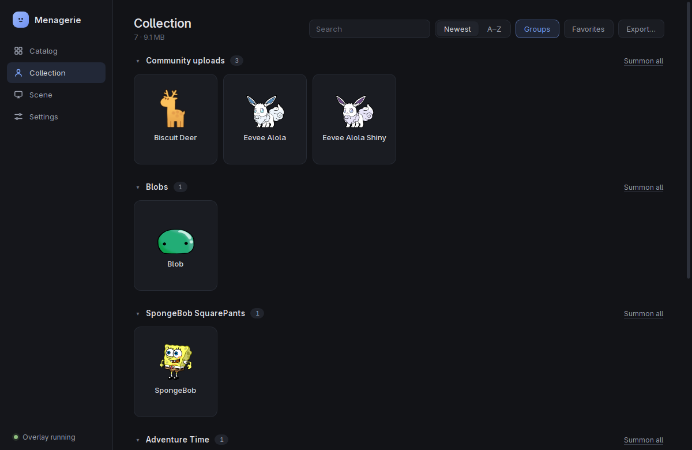
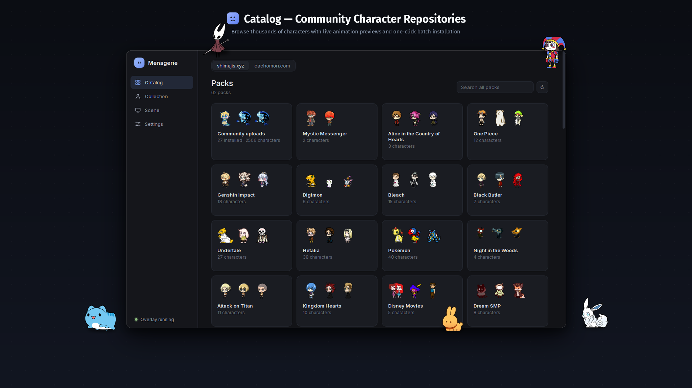
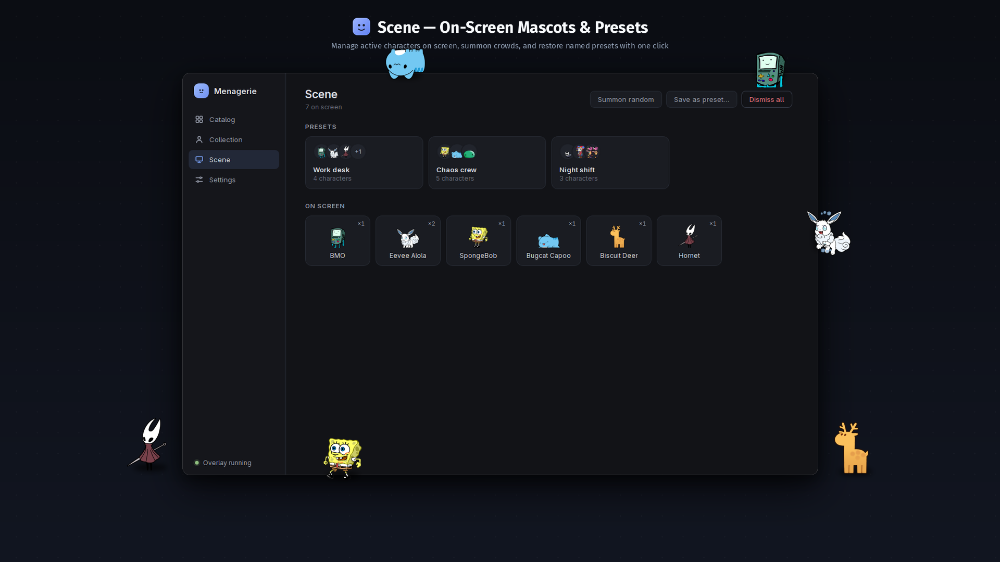
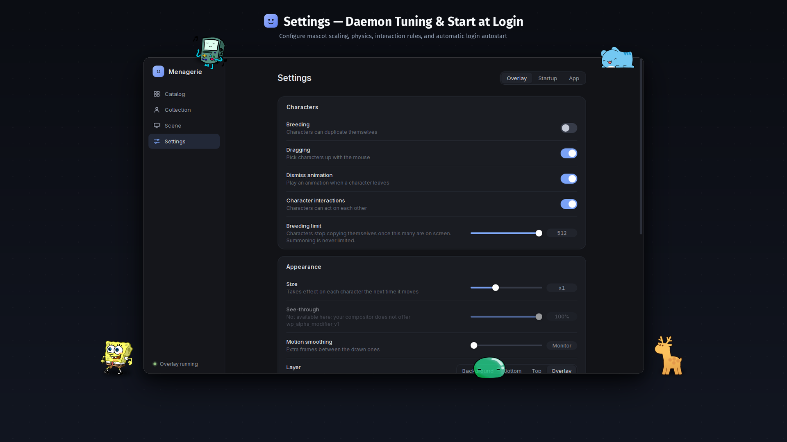

<p align="center">
  
</p>

<h1 align="center">Menagerie</h1>

<p align="center">
  Find, install and summon <b>Shimeji</b> — the little mascots that walk around your screen,<br>
  climb your windows and throw themselves off the edges — on Wayland.
</p>

<p align="center">
  <a href="https://github.com/kyzmapiratov/Menagerie/actions/workflows/ci.yml"></a>
  <a href="LICENSE"></a>
  
  <a href="https://github.com/kyzmapiratov/Menagerie/releases/latest"></a>
</p>

<p align="center">
  
</p>

Menagerie is the desktop app that [wl_shimeji](https://github.com/CluelessCatBurger/wl_shimeji) — the Wayland
engine that actually draws the characters — never had: a catalog of a few thousand characters, one-click installs, a
collection you can browse, a scene you can save and restore, and a way to bring everyone back at login.

## What it does

|   |   |
|---|---|
| **Catalog** | Two sources, no account needed. *shimejis.xyz*: around sixty franchise packs, animated preview on hover, search across everything, batch install. *cachomon.com*: free characters by franchise. |
| **Collection** | Everything installed, grouped by universe, with favorites, sorting, multi-select and export to a single `.zip`. Drop an archive on the window to install it. |
| **Scene** | Who is on screen right now. *Summon random*, *Dismiss all*, and **presets**: save the crowd under a name and bring it back with one click. |
| **Settings** | The overlay's options in plain words, read back after they are written — and honest about the ones your compositor or wl_shimeji cannot honour. **Startup** brings characters back at login on any desktop. |
| **Resilient** | If the overlay crashes, the app notices, says what happened and brings everyone back — or does it by itself. Sixty characters appear in about two seconds. |
| **Out of the way** | A tray icon to summon or clear the screen without opening a window. |

<table>
  <tr>
    <td width="50%"><br><sub><b>Catalog</b> — real previews, what you already have is marked</sub></td>
    <td width="50%"><br><sub><b>Scene</b> — the crowd on screen, and presets to bring it back</sub></td>
  </tr>
  <tr>
    <td width="50%"><br><sub><b>Collection</b> — installed characters with favorites and multi-select</sub></td>
    <td width="50%"><br><sub><b>Settings & Startup</b> — overlay configuration and login autostart</sub></td>
  </tr>
</table>

## Install

One line. It installs the app, and `wl_shimeji` too if you do not have it:

```bash
curl -fsSL https://raw.githubusercontent.com/kyzmapiratov/Menagerie/main/install.sh | bash
```

Prefer to read a script first? Good instinct — it is [install.sh](install.sh), it prints every command before it runs,
and `--dry-run` shows what it would do without doing it.

Or use your distribution's own package:

| System | How |
|---|---|
| **Arch**, CachyOS, EndeavourOS, Manjaro… | `yay -S menagerie-bin` (prebuilt) or `menagerie` (builds it) |
| **Debian, Ubuntu, Mint, Pop!_OS…** | `sudo apt install ./menagerie_*.deb` from the [latest release](https://github.com/kyzmapiratov/Menagerie/releases/latest) |
| **Fedora**, openSUSE… | `sudo dnf install ./menagerie-*.rpm` (`zypper install` on openSUSE) |
| **Anything else** | the `.AppImage` from the release, or `./install.sh --source` to build it |

Every route, the engine for each distribution and how to remove it again: **[docs/install.md](docs/install.md)**.

**You need** Linux with a Wayland session and a compositor that offers `wlr-layer-shell`. The app is built for three
setups, and says plainly how far each has been checked:

| Compositor | Support Status | Notes |
|---|---|---|
| **niri** | **Full support** | Developed and tested daily on niri. Automatic config setup (`include "menagerie.kdl"`) with backup and validation. |
| **KDE Plasma** | **Supported** | Launch at login via XDG autostart entry; shortcuts configurable in System Settings. Mascots can walk on windows using the engine's KWin plugin. |
| **Hyprland** | **Supported (with clipping limit)** | Automatic config generation (`source` line). Engine authors note that Hyprland clips subsurfaces differently, so edges may look cut off. |
| **GNOME** | **Unsupported** | Mutter does not implement `wlr-layer-shell`. The app detects GNOME on startup and displays an informative notice. |

It does **not** work on GNOME (Mutter has no layer-shell). The app checks this on start and says so, instead of leaving
you wondering why nothing appears. Details: [Will it work on my system?](docs/install.md#will-it-work-on-my-system) If you
run it on Hyprland or Plasma, an issue with what happened (good or bad) is the most useful thing you can send.

## Quick start

1. **Start it** from your application menu (`menagerie` in a terminal). If `wl_shimeji` is missing, a card tells you
   how to install it and has a *Check again* button.
2. **Catalog** → pick a pack or a character → **Install**. Characters you already have are marked and never replaced
   without asking. Prefer a file? Drop a `.zip` on the window.
3. **Collection** → click the circle in a card's corner to select (`Shift` for a range, `Ctrl+A` for all) → **Summon**.
4. **Scene** → **Save as preset…** to remember the crowd; the preset brings it back in one click.
5. **Settings → Startup** → **Turn on**, so they are there when you log in.

`Ctrl+K` opens a command palette anywhere; `Ctrl+1…4` switch tabs.

## Where things are kept

| What | Where |
|---|---|
| Characters (owned by the engine) | `~/.local/share/wl_shimeji/shimejis/` — movable from **Settings → App** |
| The app's data: favorites, presets, caches, the overlay's log | `~/.local/share/menagerie/` |
| Downloaded `.zip` archives | your Downloads folder — moved to the Trash after a successful install (switchable) |

`XDG_DATA_HOME` is honored. There is no telemetry: the app talks to the two catalogs and to nothing else.

## Documentation

| | |
|---|---|
| [docs/install.md](docs/install.md) | Every way to install, the engine per distribution, compatibility, updating and removing |
| [docs/troubleshooting.md](docs/troubleshooting.md) | Nothing appears · the overlay crashed · blank window · settings that "do nothing" |
| [docs/architecture.md](docs/architecture.md) | How it is built, and what was learned about the engine the hard way |
| [docs/development.md](docs/development.md) | Setting up, testing, packaging and releasing |
| [AGENTS.md](AGENTS.md) | The same, condensed for AI coding agents |
| [CHANGELOG.md](CHANGELOG.md) | What changed, release by release |

## Contributing

Bug reports and patches are welcome — start with [.github/CONTRIBUTING.md](.github/CONTRIBUTING.md). If your desktop is
not in the compatibility table, saying whether it worked is genuinely useful.

## License and credits

Menagerie is [GPL-2.0 licensed](LICENSE).

- [wl_shimeji](https://github.com/CluelessCatBurger/wl_shimeji) by CluelessCatBurger — the engine, GPL-2.0. It runs as a
  separate program; nothing of it is linked into this app.
- Shimeji was created by Yuki Yamada of Group Finity; [Shimeji-ee](https://github.com/TigerHix/shimeji-ee) is the English
  branch whose default configuration files ship with this app.
- Character art belongs to whoever made it. The pictures above show characters from the two catalogs; none is stored in
  this repository — they are downloaded by you, when you ask for it.

Full details in [docs/third-party.md](docs/third-party.md).
