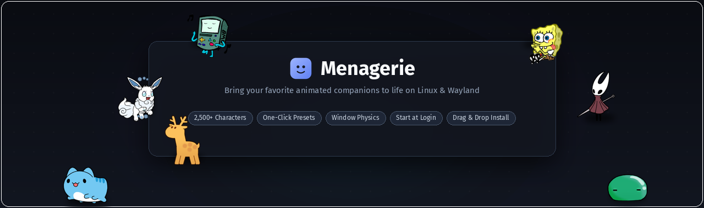
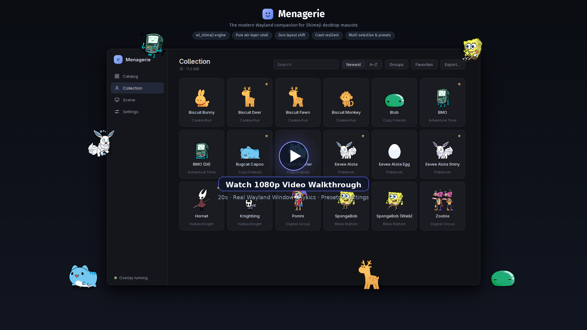

<p align="center">
  
</p>

<h1 align="center">Menagerie</h1>

<p align="center">
  <b>The modern Shimeji companion manager for Linux & Wayland.</b><br>
  Find, install, and summon animated desktop companions that climb window borders, roam screen edges, and tumble with real physics.
</p>

<p align="center">
  <a href="https://github.com/kyzmapiratov/Menagerie/actions/workflows/ci.yml"></a>
  <a href="LICENSE"></a>
  
  <a href="https://github.com/kyzmapiratov/Menagerie/releases/latest"></a>
</p>

---

<p align="center">
  <a href="https://github.com/kyzmapiratov/Menagerie/blob/main/docs/img/walkthrough.mp4">
    
  </a>
  <br>
  <sub><b>▶ Click above to watch the full 1080p video walkthrough on GitHub</b> (also available in <a href="docs/img/walkthrough.webm">WebM</a>)</sub>
</p>

### Video Chapters

| Chapter | Overview | Video Link |
|:---|:---|:---|
| **01 · Catalog** | Dual repositories (`shimejis.xyz` and `cachomon.com`), live hover previews & batch installation | [▶ Watch Part 1 (MP4)](docs/img/part1_catalog.mp4) |
| **02 · Collection** | Universe grouping, favorites, multi-selection, and automatic drag-and-drop archive import | [▶ Watch Part 2 (MP4)](docs/img/part2_collection.mp4) |
| **03 · Scene & Presets** | Active mascot management, one-click preset restoration, and Wayland window physics | [▶ Watch Part 3 (MP4)](docs/img/part3_scene.mp4) |
| **04 · Settings & Startup** | Scale divisor controls, engine telemetry, crash resilience, and login autostart | [▶ Watch Part 4 (MP4)](docs/img/part4_settings.mp4) |

---

Menagerie is the desktop app that [wl_shimeji](https://github.com/CluelessCatBurger/wl_shimeji) — the Wayland
engine that actually draws the characters — never had: a catalog of over 2,500 characters, one-click installs,
a library grouped by universe, a scene you can save into named presets, and startup integration for any desktop.

## Highlights

### 📦 Catalog — Thousands of Mascots in One Click

<p align="center">
  
</p>

- **Dual Catalogs, No Accounts**: Switch between 60+ franchise packs on *shimejis.xyz* and curated mascots on *cachomon.com*.
- **Live Animated Previews**: Hover over any card to preview its animation frames before downloading.
- **Conflict-Free**: Mascots you already own are clearly badged and never overwritten without asking.

---

### 🎒 Collection — Organize, Multi-Select & Export

<p align="center">
  
</p>

- **Universe Grouping**: Automatically organize your local library by universe (Pokémon, Mario, Studio Ghibli, Anime, etc.).
- **Batch Actions**: Select multiple characters with `Shift+Click` or `Ctrl+A` to summon entire squads at once.
- **Drag & Drop Archive Import**: Drop any `.zip` Shimeji archive directly onto the app to extract, patch animation gaps, and install.

---

### 🎭 Scene & Presets — Window Physics & Formations

<p align="center">
  
</p>

- **Wayland Window Physics**: Through `wlr-layer-shell`, mascots interact with actual application windows — climbing borders, hanging from titlebars, and falling under gravity.
- **One-Click Presets**: Save your current crowd formation under custom names (*Focus Companions*, *Chaos Squad*) and summon them back with a single click.
- **Screen Control**: Inspect active mascots, summon random companions, or dismiss the entire screen instantly.

---

### ⚙️ Settings & Startup — Painless Configuration & Autostart

<p align="center">
  
</p>

- **Start at Login**: One-click autostart setup for **niri** (`include "menagerie.kdl"` with automatic backup and validation), **Hyprland** (`source` line), and **KDE Plasma** / XDG.
- **Honest Engine Tuning**: Real-time readback for mascot scale divisors and physics options, clearly explaining any engine limitations.
- **Crash Resilient**: Actively monitors the overlay process; if the Wayland layer-shell engine stops, Menagerie alerts you and restores your crowd in seconds.
- **System Tray**: Convenient tray icon to summon presets or dismiss characters without keeping the window open.

---

## Install

One line. Installs the app, and `wl_shimeji` too if you do not already have it:

```bash
curl -fsSL https://raw.githubusercontent.com/kyzmapiratov/Menagerie/main/install.sh | bash
```

Prefer to inspect the script first? Read [install.sh](install.sh) — it prints every command before running, and `--dry-run` previews actions without making changes.

Or install using your distribution's native package:

| Distribution | Installation Command |
|:---|:---|
| **Arch Linux**, CachyOS, EndeavourOS, Manjaro | `yay -S menagerie-bin` (prebuilt) or `menagerie` (source) |
| **Debian, Ubuntu, Mint, Pop!_OS** | `sudo apt install ./menagerie_*.deb` from [latest release](https://github.com/kyzmapiratov/Menagerie/releases/latest) |
| **Fedora**, openSUSE | `sudo dnf install ./menagerie-*.rpm` (`zypper install` on openSUSE) |
| **Other Distributions** | `.AppImage` from [latest release](https://github.com/kyzmapiratov/Menagerie/releases/latest), or `./install.sh --source` |

Full instructions and distribution dependencies: **[docs/install.md](docs/install.md)**.

---

## Compositor Support

Menagerie requires a Linux Wayland session with a compositor implementing `wlr-layer-shell`:

| Compositor | Support Status | Notes |
|:---|:---|:---|
| **niri** | **Full support** | Developed and tested daily on niri. Automatic config setup (`include "menagerie.kdl"`) with backup and validation. |
| **KDE Plasma** | **Supported** | Launch at login via XDG autostart entry; shortcuts configurable in System Settings. Mascots can walk on windows using the engine's KWin plugin. |
| **Hyprland** | **Supported (with clipping limit)** | Automatic config generation (`source` line). Engine authors note that Hyprland clips subsurfaces differently, so edges may look cut off. |
| **GNOME** | **Unsupported** | Mutter does not implement `wlr-layer-shell`. The app detects GNOME on startup and displays an informative notice. |

Details: [Will it work on my system?](docs/install.md#will-it-work-on-my-system).

---

## Quick Start

1. **Launch Menagerie** from your application launcher or run `menagerie` in a terminal.
2. **Catalog** → Browse packs or characters → click **Install**. Already installed characters are marked.
3. **Collection** → Select characters with the card badge (`Shift` for range, `Ctrl+A` for all) → click **Summon**.
4. **Scene** → Click **Save as preset…** to remember the active crowd; re-summon anytime with one click.
5. **Settings → Startup** → Click **Turn on** to bring your companions back automatically at login.

> Tip: Press `Ctrl+K` to open the command palette anywhere, or `Ctrl+1…4` to switch tabs.

---

## Where Things Are Kept

| Item | Location |
|:---|:---|
| Character prototypes (engine files) | `~/.local/share/wl_shimeji/shimejis/` (configurable in **Settings → App**) |
| App data (favorites, presets, caches, logs) | `~/.local/share/menagerie/` |
| Downloaded `.zip` archives | Downloads folder (moved to Trash after install; switchable) |

`XDG_DATA_HOME` is fully respected. No telemetry: Menagerie only connects to the two public mascot catalogs.

---

## Documentation

- **[docs/install.md](docs/install.md)** — Comprehensive installation options, updates, and uninstallation.
- **[docs/troubleshooting.md](docs/troubleshooting.md)** — Fix missing mascots, compositor quirks, or overlay crashes.
- **[docs/architecture.md](docs/architecture.md)** — Architectural design, performance data, and `wl_shimeji` quirks.
- **[docs/development.md](docs/development.md)** — Local development, UI test harness, packaging, and releases.
- **[AGENTS.md](AGENTS.md)** — Concise guidelines for AI coding agents.
- **[CHANGELOG.md](CHANGELOG.md)** — Detailed version history.

---

## Contributing

Bug reports and feature suggestions are warmly welcomed! Please check [.github/CONTRIBUTING.md](.github/CONTRIBUTING.md).

---

## License & Credits

Menagerie is licensed under [GPL-2.0](LICENSE).

- **[wl_shimeji](https://github.com/CluelessCatBurger/wl_shimeji)** by CluelessCatBurger — the underlying Wayland layer-shell engine (GPL-2.0). Runs as a standalone process.
- **Shimeji** was created by Yuki Yamada of Group Finity; [Shimeji-ee](https://github.com/TigerHix/shimeji-ee) is the open-source branch providing XML definitions.
- Character artwork belongs to its respective creators and artists. Artwork is downloaded directly by users from catalog providers on demand.

See [docs/third-party.md](docs/third-party.md) for full attribution.
